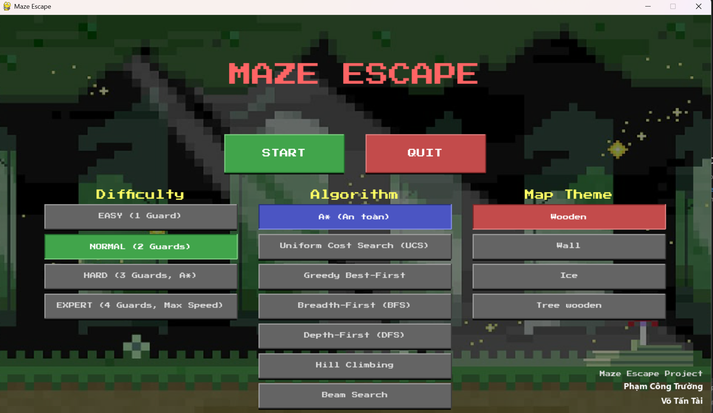
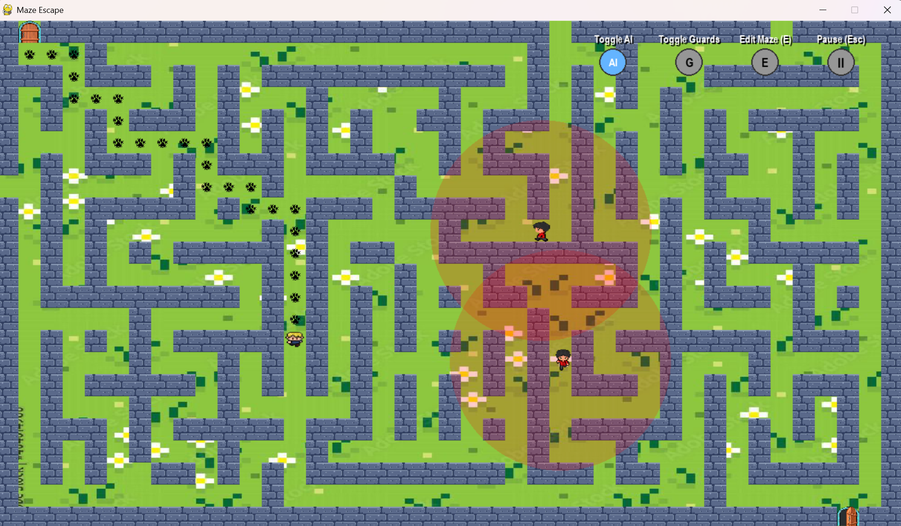
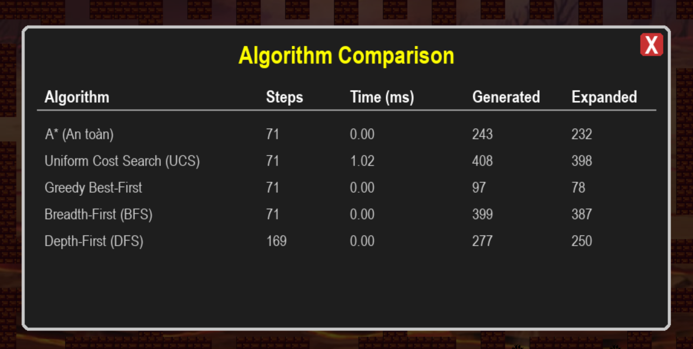

# Maze Escape: Trực quan hóa Thuật toán Tìm đường

Một project game 2D được xây dựng bằng Python và Pygame, không chỉ là một trò chơi giải đố mê cung mà còn là một công cụ mạnh mẽ để trực quan hóa, so sánh và tìm hiểu về các thuật toán tìm đường phổ biến trong lĩnh vực Trí tuệ nhân tạo.

)
*(Menu chính của game)*

---

## 🌟 Tính năng nổi bật

-   **Sinh mê cung ngẫu nhiên:** Mỗi lần chơi là một thử thách mới với mê cung được tạo ra tự động. Hỗ trợ hiệu ứng trực quan hóa quá trình sinh mê cung.

-   **Nhiều thuật toán tìm đường:** Tích hợp 7 thuật toán AI khác nhau để người chơi lựa chọn và so sánh:
    -   A* (An toàn)
    -   Uniform Cost Search (UCS)
    -   Greedy Best-First Search
    -   Breadth-First Search (BFS)
    -   Depth-First Search (DFS)
    -   Hill Climbing
    -   Beam Search

-   **AI Player thông minh:**
    -   **Tìm đường chiến lược:** AI (A*) có khả năng tính toán "chi phí nguy hiểm" để chủ động tìm những con đường vòng qua khu vực có lính gác.
    -   **Né tránh chiến thuật:** Khi gặp nguy hiểm bất ngờ, AI sẽ kích hoạt "chế độ né tránh" để tìm một vị trí an toàn tạm thời, tránh bị kẹt trong các vòng lặp di chuyển.

-   **Công cụ so sánh thuật toán:**
    -   **Bảng so sánh chi tiết:** Sau khi chơi, người dùng có thể xem một bảng thống kê chi tiết hiệu năng của các thuật toán đã chạy trên cùng một mê cung. Các thông số bao gồm: Thời gian thực thi, Số bước đi, Số nút đã duyệt (Expanded), và Số nút đã được tạo (Generated).
    -   **Chơi lại (Replay):** Dễ dàng chạy lại nhiều thuật toán khác nhau trên cùng một mê cung để thu thập dữ liệu so sánh một cách công bằng.

-   **Chế độ Edit Map:** Cho phép người dùng chỉnh sửa mê cung trực tiếp trong lúc chơi bằng cách nhấn giữ và kéo chuột, với hệ thống cảnh báo tự động khi chặn hết lối ra.

-   **Tùy chỉnh đa dạng:** Người chơi có thể tùy chỉnh độ khó (ảnh hưởng đến số lượng và tốc độ lính gác) và chủ đề hình ảnh của bản đồ.

-   **Hiệu ứng trực quan:** Nhân vật để lại dấu chân trên đường đi, giúp người chơi dễ dàng theo dõi lại lộ trình của mình.


*(Gameplay với chế độ AI và dấu chân)*

---

## 🛠️ Công nghệ sử dụng

-   **Ngôn ngữ:** Python 3
-   **Thư viện:** Pygame (để xử lý đồ họa, âm thanh, và sự kiện)

---

## 🚀 Cài đặt và Chạy

1.  **Clone repository về máy:**
    ```bash
    git clone https://github.com/SaiCTruong/Game-Escape-Maze
    ```

2.  **Di chuyển vào thư mục project:**
    ```bash
    cd Game-Escape-Maze
    ```

3.  **Tạo môi trường ảo (khuyến khích):**
    ```bash
    python -m venv venv
    ```
    -   Trên Windows: `venv\Scripts\activate`
    -   Trên macOS/Linux: `source venv/bin/activate`

4.  **Cài đặt Pygame trực tiếp vào môi trường ảo:**
    *Hãy đảm bảo bạn vẫn thấy (venv) ở đầu dòng lệnh, sau đó chạy lệnh sau:*
    ```bash
    pip install pygame
    ```

5.  **Cài đặt các thư viện cần thiết:**
    *(Nếu bạn chưa có file `requirements.txt`, hãy tạo nó bằng lệnh: `pip freeze > requirements.txt`)*
    ```bash
    pip install -r requirements.txt
    ```

6.  **Chạy game:**
    ```bash
    python -m game.main
    ```

---

## 🎮 Hướng dẫn chơi

-   **Menu chính:**
    -   Sử dụng chuột để chọn các tùy chọn: **Difficulty**, **Algorithm**, **Map Theme**.
    -   Nhấn **START** để bắt đầu.

-   **Trong Game:**
    -   **Di chuyển:** Sử dụng các phím `Mũi tên` hoặc `W, A, S, D`.
    -   **Bật/Tắt AI:** Nhấn phím `A`.
    -   **Chế độ sửa Map:** Nhấn phím `E` để vào/thoát chế độ sửa. Trong chế độ này, nhấn giữ và kéo chuột trái để vẽ/xóa tường.
    -   **Ẩn/Hiện lính gác:** Nhấn phím `G`.
    -   **Tạm dừng:** Nhấn `ESC` hoặc nút "II" ở góc trên bên phải.

-   **Màn hình kết thúc:**
    -   **Xem thông số:** Nhấn nút `i` ở góc trên bên trái để mở/đóng bảng so sánh thuật toán.
    -   **Chơi lại:** Nhấn nút `Replay` để chọn thuật toán khác và chơi lại trên cùng mê cung.


*(Bảng so sánh hiệu năng các thuật toán)*

---

## 📁 Cấu trúc thư mục

```
game_project/
├── game/
│   ├── ai/               # Chứa logic các thuật toán tìm đường
│   ├── assets/           # Chứa tài nguyên (hình ảnh, fonts)
│   ├── controllers/      # Chứa các lớp quản lý (GuardManager)
│   ├── entities/         # Chứa các đối tượng trong game (Player, Guard)
│   ├── maze/             # Chứa logic sinh mê cung
│   ├── render/           # Chứa các lớp vẽ giao diện (Menu, Renderer)
│   ├── __init__.py
│   ├── config.py         # Chứa các hằng số và cài đặt chung
│   └── main.py           # File chính, chứa vòng lặp game
├── requirements.txt      # Danh sách các thư viện cần thiết
└── README.md             # File bạn đang đọc
```
---

## 👨‍💻 Tác giả

* **Võ Tấn Tài** - [Anttia2404](https://github.com/Anttia2404)
* **Phạm Công Trường** - [SaiCTruong](https://github.com/SaiCTruong)